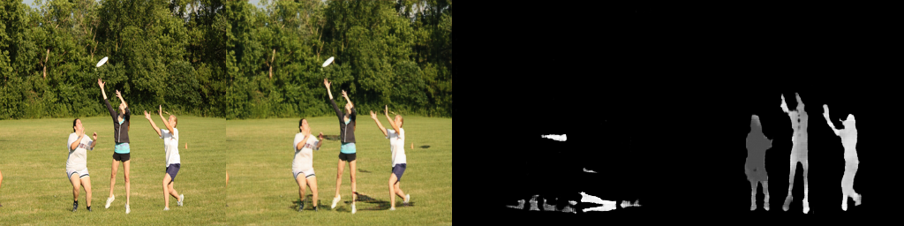

# Realistic Shadow Generation with GAN

This project demonstrates realistic shadow generation on natural images using a custom-trained GAN model. Given a deshadowed input image, the model learns to cast shadows in appropriate regions, conditioned on the shadow mask and instance segmentation.

---

## Project Structure

- `1_shadow_generation_code.ipynb`: Main Colab notebook for model inference
- `assets/`: Folder containing input, output, and mask visualizations
- `models/`: Generator and discriminator architectures 
- `utils/`: Image preprocessing and visualization functions

---

## How It Works

1. **Input**: A deshadowed RGB image
2. **Preprocessing**: Generates:
   - Shadow mask (binary)
   - Instance mask (semantic segmentation)
3. **GAN-based Generation**: Produces a realistic shadow-cast image
4. **Post-processing**: Visualization and export

---

## Technologies Used

- Python, PyTorch, NumPy, OpenCV
- Google Colab for experimentation
- GANs: U-Net Generator, PatchGAN Discriminator

---

## Notes

- This is a research-oriented prototype for cast shadow synthesis.
- Ideal for use in training data augmentation, simulation, or visual effects.

---

## Acknowledgement

The sample image of players in action was sourced from an open dataset for testing purposes.
The outputs shown in the image represent:

**Input Image:** Original deshadowed RGB image

**Generated Shadow Image:** Realistic shadow-cast output produced by the GAN
**Shadow Mask:** Binary mask highlighting the shadowed regions
**Instance Mask:** Semantic segmentation mask indicating different players.

